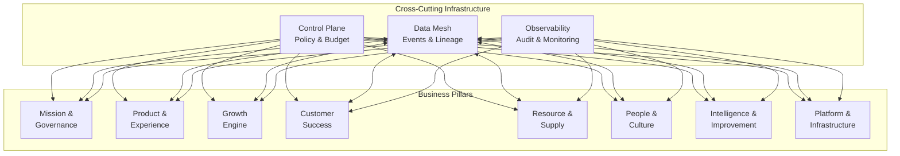

# Business Pillar Agents

This sample demonstrates the complete **Business Pillar Agents** implementation - the application tier of an AI-native company. Eight specialized agent swarms handle every universal business workflow while integrating with the Control Plane, Data Mesh, and Trust & Observability layers.

## Overview

The Business Pillar Agents represent the **workhorses of the AI-native architecture**: eight autonomous (but policy-bound) agent teams that together cover every universal business workflow. They talk through the event bus, obey the global control-plane, and leave a perfectly traceable audit trail.

### Why Eight Pillars?

The eight-pillar model optimizes for:

1. **Data-flow alignment** - Each pillar maps to coherent source systems and APIs
2. **End-to-end accountability** - Clear ownership and measurable outcomes  
3. **Agent fit** - LLM agents perform best with narrowly defined but outcome-measurable scope
4. **Minimal cross-team chatter** - Reduced coordination overhead

## Architecture Components

### 1. The Eight Business Pillars

| Pillar | Core Goal | Key Agents | Example Guardrails |
|--------|-----------|------------|-------------------|
| **Mission & Governance** | Set direction, allocate capital, stay compliant | Budget-Governor, Risk-Auditor, Policy-Compiler | Daily VaR limit, board-vote threshold |
| **Product & Experience** | Discover, design, build, ship, document | Market-Scout, Spec-Writer, Dev-Implementer, QA-Critic | All merges need passing tests + OPA scan |
| **Growth Engine** | Generate demand and revenue | Ad-Bidder, Pricing-Bot, Quote-Gen | Margin floor, ad-budget cap per day |
| **Customer Success** | Delight, support and retain users | Support-Responder, Refund-Bot, Churn-Sentinel | Auto-refund only ≤ $100, NPS drop alert |
| **Resource & Supply** | Plan, source, make/deliver, pay | Forecast-Planner, PO-Issuer, Payables-Matcher | Re-order ceiling, 3-way match |
| **People & Culture** | Recruit, onboard, grow, off-board | Talent-Scout, Onboard-Agent, Pulse-Surveyor | Bias-eval ≥ 0.9, role-based IAM |
| **Intelligence & Improvement** | Measure, learn, optimise | Metric-Collector, Experiment-Designer, Drift-Detector | Model uplift > X% before auto-promote |
| **Platform & Infrastructure** | Keep the machine running | Orchestrator-Kernel, Security-Sentinel, Cost-Optimizer | mTLS everywhere, cost alert at +15% MoM |

### 2. Agent Role Specialization

Each pillar contains four types of specialized agents:

- **Planner** - Strategic planning and coordination
- **Worker** - Execution and implementation  
- **Critic** - Quality assurance and validation
- **Guard** - Security and compliance monitoring

### 3. Integration Architecture



## Key Features

### Event-Driven Coordination

Pillars communicate through standardized events:

```python
# Example: Growth Engine triggers Customer Success action
await growth_pillar.publish_event(
    "deal.won",
    {
        "customer_id": "enterprise_001",
        "deal_value": 150000,
        "onboarding_priority": "high"
    },
    target_pillar="Customer Success"
)
```

### Policy Enforcement

Every tool call passes through the Control Plane:

```python
# Policy check before tool execution
result = await agent.call_tool(
    "approve_expenditure",
    {"amount": 5000, "purpose": "marketing_campaign"},
    trace_id="trace_001"
)
# Automatically enforces budget caps, AML restrictions, compliance
```

### Autonomy Maturity Levels (AML 0-5)

Each agent operates at an appropriate autonomy level:

- **AML 0**: Read-only insights (100% human involvement)
- **AML 1**: Suggest actions (approve every action)  
- **AML 2**: Batch execution (approve batches)
- **AML 3**: Real-time execution under hard caps (approve exceptions)
- **AML 4**: Self-correcting execution, soft caps (quarterly audit)
- **AML 5**: Uncapped with treasury limits (kill-switch only)

### Complete Audit Trail

All agent actions are tracked with lineage:

```python
# Automatic lineage tracking
await lineage_service.track_tool_invocation(
    agent_id="pricing_bot",
    tool_name="calculate_optimal_price",
    trace_id="trace_001",
    inputs={"product": "enterprise_plan"},
    outputs={"price": 299.99, "margin": 0.65},
    pillar="Growth Engine"
)
```

## Usage

### Basic Pillar Setup

```python
from contributing.samples.business_pillars import (
    PillarRegistry,
    GrowthEnginePillar,
    CustomerSuccessPillar
)
from contributing.samples.control_plane import Treasury, LocalPolicyEngine
from contributing.samples.data_mesh import EventBusFactory, LineageService

# Initialize infrastructure
event_bus = EventBusFactory.create("memory")
lineage_service = LineageService()
treasury = Treasury(total_budget=1000000.0)
policy_engine = LocalPolicyEngine()

# Create pillar registry
pillar_registry = PillarRegistry()

# Initialize pillars
growth_pillar = GrowthEnginePillar(
    event_bus=event_bus,
    lineage_service=lineage_service,
    treasury=treasury,
    policy_engine=policy_engine
)

customer_pillar = CustomerSuccessPillar(
    event_bus=event_bus,
    lineage_service=lineage_service
)

# Register pillars
pillar_registry.register_pillar(growth_pillar)
pillar_registry.register_pillar(customer_pillar)
```

### Execute Pillar Workflows

```python
# Execute single pillar workflow
result = await growth_pillar.execute_workflow(
    "lead_to_quote",
    {
        "customer_id": "prospect_001",
        "product_id": "enterprise_plan",
        "customer_segment": "enterprise",
        "deal_size": "large"
    }
)

print(f"Quote generated: {result.final_output['quote']['quote_id']}")
```

### Cross-Pillar Coordination

```python
# Execute workflow across multiple pillars
result = await pillar_registry.execute_cross_pillar_workflow(
    primary_pillar=PillarType.GROWTH_ENGINE,
    workflow_type="enterprise_customer_acquisition",
    inputs={
        "prospect_company": "TechCorp Inc",
        "deal_size": 150000
    },
    involved_pillars=[
        PillarType.GROWTH_ENGINE,
        PillarType.CUSTOMER_SUCCESS,
        PillarType.PRODUCT_EXPERIENCE
    ]
)
```

### Agent Customization

```python
# Create custom agent
class CustomAnalyticsAgent(BusinessPillarAgent):
    def __init__(self, **kwargs):
        super().__init__(
            agent_id="custom_analytics",
            role=AgentRole.CRITIC,
            pillar=PillarType.INTELLIGENCE_IMPROVEMENT,
            **kwargs
        )
        self._setup_tools()
    
    def _setup_tools(self):
        self.register_tool("analyze_metrics", self._analyze_metrics, cost=1.0)
    
    async def _analyze_metrics(self, data: Dict[str, Any]) -> Dict[str, Any]:
        # Custom analytics logic
        return {"analysis": "custom_result"}
    
    async def execute_task(self, task: str, context: Dict[str, Any], workflow_id: Optional[str] = None):
        if task == "custom_analysis":
            return await self._analyze_metrics(context)
        else:
            raise ValueError(f"Unknown task: {task}")
    
    def get_capabilities(self) -> List[str]:
        return ["custom_analytics", "specialized_analysis"]

# Register custom agent
intelligence_pillar = pillar_registry.get_pillar(PillarType.INTELLIGENCE_IMPROVEMENT)
custom_agent = CustomAnalyticsAgent(
    event_bus=event_bus,
    lineage_service=lineage_service
)
intelligence_pillar.register_agent(custom_agent)
```

## Running the Example

### Complete Enterprise Simulation

```bash
cd contributing/samples/business_pillars
python business_pillars_example.py
```

This runs a full day simulation showing:

1. **Morning**: Strategic planning and budget allocation
2. **Mid-Morning**: Product development cycle
3. **Midday**: Customer success and growth activities  
4. **Afternoon**: Operations and supply chain
5. **Evening**: Analytics and optimization
6. **End of Day**: Platform health check

### Individual Pillar Testing

```python
# Test specific pillar
from contributing.samples.business_pillars import GrowthEnginePillar

pillar = GrowthEnginePillar()
result = await pillar.execute_workflow(
    "campaign_optimization",
    {"campaign_id": "test_campaign"}
)
```

## Pillar Details

### Mission & Governance Pillar

**Core Responsibility**: Set direction, allocate capital, stay compliant

**Key Agents**:
- `BudgetGovernor` - Budget allocation and capital deployment
- `RiskAuditor` - Risk monitoring and compliance auditing  
- `PolicyCompiler` - Business rule to policy translation

**Sample Workflow**:
```python
result = await mission_pillar.execute_workflow(
    "budget_allocation_review",
    {
        "Growth Engine_budget": 200000,
        "Product & Experience_budget": 150000,
        "Growth Engine_justification": "Q1 growth targets"
    }
)
```

**Guardrails**: Daily VaR limit, board-vote threshold, multisig requirements

### Product & Experience Pillar

**Core Responsibility**: Discover, design, build, ship, document

**Key Agents**:
- `MarketScout` - Market research and competitive analysis
- `SpecWriter` - Product specifications and requirements
- `DevImplementer` - Code implementation and development
- `QACritic` - Quality assurance and testing

**Sample Workflow**:
```python
result = await product_pillar.execute_workflow(
    "feature_development",
    {
        "feature_name": "Advanced Analytics Dashboard",
        "segment": "enterprise"
    }
)
```

**Guardrails**: All merges need passing tests + OPA scan, security reviews

### Growth Engine Pillar

**Core Responsibility**: Generate demand and revenue

**Key Agents**:
- `AdBidder` - Advertising campaign management and bidding
- `PricingBot` - Dynamic pricing and discount optimization
- `QuoteGenerator` - Sales quote generation and tracking

**Sample Workflow**:
```python
result = await growth_pillar.execute_workflow(
    "lead_to_quote",
    {
        "customer_id": "prospect_001",
        "product_id": "enterprise_plan"
    }
)
```

**Guardrails**: Margin floor (25%), ad-budget cap per day ($2,000)

### Customer Success Pillar

**Core Responsibility**: Delight, support and retain users

**Key Agents**:
- `SupportResponder` - Customer support and issue resolution
- `RefundBot` - Automated refund processing with policy compliance
- `ChurnSentinel` - Churn detection and prevention

**Sample Workflow**:
```python
result = await customer_pillar.execute_workflow(
    "ticket_to_resolution",
    {
        "customer_id": "cust_001",
        "subject": "Performance issue",
        "description": "Dashboard loading slowly"
    }
)
```

**Guardrails**: Auto-refund only ≤ $100, NPS drop alerts, escalation thresholds

### Resource & Supply Pillar

**Core Responsibility**: Plan, source, make/deliver, pay

**Key Agents**:
- `ForecastPlanner` - Demand forecasting and inventory planning
- `POIssuer` - Purchase order creation and supplier validation
- `PayablesMatcher` - 3-way matching and payment approval

**Sample Workflow**:
```python
result = await supply_pillar.execute_workflow(
    "procurement_cycle",
    {
        "product_id": "server_hardware",
        "supplier_id": "tech_supplier_001",
        "total_amount": 15000
    }
)
```

**Guardrails**: Re-order ceiling, inventory buffer, 3-way match requirement

### People & Culture Pillar

**Core Responsibility**: Recruit, onboard, grow, off-board

**Key Agents**:
- `TalentScout` - Bias-free recruitment and candidate sourcing
- `OnboardAgent` - Employee onboarding and account provisioning
- `PulseSurveyor` - Employee engagement and culture insights

**Sample Workflow**:
```python
result = await people_pillar.execute_workflow(
    "hire_to_onboard",
    {
        "role": "Senior Software Engineer",
        "employee_id": "emp_2024_001"
    }
)
```

**Guardrails**: Bias-eval ≥ 0.9, role-based IAM granting, diversity requirements

### Intelligence & Improvement Pillar

**Core Responsibility**: Measure, learn, optimise

**Key Agents**:
- `MetricCollector` - Metrics collection and trend analysis
- `ExperimentDesigner` - A/B testing and statistical analysis
- `DriftDetector` - Model drift and performance anomaly detection

**Sample Workflow**:
```python
result = await intelligence_pillar.execute_workflow(
    "optimization_cycle",
    {
        "metric_types": ["revenue", "engagement"],
        "hypothesis": "New feature improves retention"
    }
)
```

**Guardrails**: Model uplift > X% before auto-promote, statistical significance

### Platform & Infrastructure Pillar

**Core Responsibility**: Keep the machine running

**Key Agents**:
- `OrchestratorKernel` - Platform orchestration and resource management
- `SecuritySentinel` - Security monitoring and incident response
- `CostOptimizer` - Cost optimization and budget monitoring

**Sample Workflow**:
```python
result = await platform_pillar.execute_workflow(
    "platform_health_check",
    {
        "resource_type": "compute",
        "action": "scale"
    }
)
```

**Guardrails**: mTLS everywhere, cost alert at +15% MoM, security compliance

## Event-Driven Coordination

### Standard Event Types

Each pillar publishes standardized events:

```python
# Mission & Governance
EventType.POLICY_UPDATE
EventType.BUDGET_APPROVAL  
EventType.RISK_ALERT

# Product & Experience
EventType.FEATURE_RELEASE
EventType.CODE_MERGE
EventType.QA_RESULT

# Growth Engine
EventType.CAMPAIGN_LAUNCH
EventType.LEAD_GENERATED
EventType.DEAL_WON

# Customer Success  
EventType.TICKET_CREATED
EventType.REFUND_PROCESSED
EventType.CHURN_RISK

# And so on for all pillars...
```

### Cross-Pillar Event Flows

Example event flows between pillars:

1. **Product Release Flow**:
   - Product & Experience → `FEATURE_RELEASE`
   - Growth Engine receives → launches marketing campaign
   - Customer Success receives → updates support documentation

2. **Customer Issue Flow**:
   - Customer Success → `CHURN_RISK` 
   - Growth Engine receives → offers retention discount
   - Mission & Governance receives → updates risk assessment

3. **Budget Alert Flow**:
   - Platform & Infrastructure → `COST_ALERT`
   - Mission & Governance receives → reviews budget allocation
   - All pillars receive → implement cost controls

## Monitoring and Observability

### Lineage Tracking

Every agent action creates lineage entries:

```python
# Query lineage for impact analysis
lineage_query = LineageQuery(
    node_id="agent:pricing_bot",
    direction="downstream",
    max_depth=5
)

results = await lineage_service.query_lineage(lineage_query)
print(f"Affected systems: {results['stats']['total_nodes']}")
```

### Performance Metrics

Track pillar and agent performance:

```python
# Get pillar status
status = pillar_registry.get_system_status()
print(f"Active pillars: {status['total_pillars']}")

for pillar_name, pillar_info in status['pillars'].items():
    print(f"{pillar_name}: {len(pillar_info['agents'])} agents")
```

### Event Analytics

Monitor cross-pillar communication:

```python
# Analyze event patterns
event_counts = {}
for event in processed_events:
    pillar = event['source_pillar']
    event_counts[pillar] = event_counts.get(pillar, 0) + 1

print("Events by pillar:", event_counts)
```

## Integration with Other Components

### Control Plane Integration

```python
# Agents automatically integrate with control plane
from contributing.samples.control_plane import ControlPlaneAgent

controlled_agent = ControlPlaneAgent(
    wrapped_agent=base_agent,
    pillar="Growth Engine",
    lineage_service=lineage_service
)

# All tool calls now enforce policies and budgets
```

### Data Mesh Integration

```python
# Events flow through data mesh
from contributing.samples.data_mesh import EventBusFactory

event_bus = EventBusFactory.create("kafka", 
    bootstrap_servers="kafka.company.com:9092"
)

# Pillars publish to standardized topics
await pillar.publish_event("deal.won", payload, "Customer Success")
```

## Best Practices

### Agent Design

1. **Single Responsibility** - Each agent has a clear, focused purpose
2. **Event-Driven** - Communicate via events, not direct calls
3. **Policy Compliant** - All tools respect guardrails and budgets
4. **Lineage Aware** - Track data flow and dependencies

### Pillar Coordination

1. **Loose Coupling** - Pillars communicate via events, not direct integration
2. **Standard Schemas** - Use consistent event schemas across pillars
3. **Graceful Degradation** - Handle missing or failed pillar responses
4. **Audit Everything** - Maintain complete audit trails

### Autonomy Management

1. **Start Conservative** - Begin with lower autonomy levels (AML 1-2)
2. **Gradual Promotion** - Increase autonomy based on performance
3. **Monitor Drift** - Watch for performance degradation
4. **Emergency Controls** - Maintain kill switches and manual overrides

### Operational Excellence

1. **Health Monitoring** - Continuously monitor pillar and agent health
2. **Performance Optimization** - Optimize high-frequency workflows
3. **Cost Management** - Track and optimize agent operational costs
4. **Security First** - Enforce security policies at every level

## Advanced Features

### Custom Workflows

Create complex workflows spanning multiple pillars:

```python
class CustomEnterpriseWorkflow:
    async def execute(self, pillar_registry: PillarRegistry):
        # Complex multi-pillar orchestration
        results = {}
        
        # Step 1: Mission approval
        mission_result = await pillar_registry.execute_workflow(...)
        
        # Step 2: Resource allocation
        if mission_result.success:
            resource_result = await pillar_registry.execute_workflow(...)
        
        # Step 3: Parallel execution
        tasks = [
            growth_pillar.execute_workflow(...),
            product_pillar.execute_workflow(...),
            customer_pillar.execute_workflow(...)
        ]
        parallel_results = await asyncio.gather(*tasks)
        
        return {"mission": mission_result, "parallel": parallel_results}
```

### Dynamic Agent Configuration

Adjust agent behavior based on business conditions:

```python
# Adjust autonomy based on performance
if agent_performance_score > 0.9:
    aml_registry.promote_agent(agent_id)
elif agent_performance_score < 0.7:
    aml_registry.demote_agent(agent_id)

# Adjust budgets based on seasonal patterns
if is_holiday_season():
    treasury.increase_pillar_budget("Growth Engine", multiplier=1.5)
```

### Integration Testing

Test pillar interactions:

```python
async def test_cross_pillar_integration():
    # Setup test environment
    test_registry = PillarRegistry()
    
    # Execute test scenario
    result = await test_registry.execute_cross_pillar_workflow(
        primary_pillar=PillarType.GROWTH_ENGINE,
        workflow_type="test_scenario",
        inputs=test_data,
        involved_pillars=[PillarType.CUSTOMER_SUCCESS]
    )
    
    # Verify results
    assert result["success"]
    assert "Growth Engine" in result["results"]
    assert "Customer Success" in result["results"]
```

## Security Considerations

1. **Event Encryption** - Encrypt sensitive event payloads
2. **Agent Authentication** - Authenticate agents before tool execution
3. **Audit Retention** - Maintain audit logs for compliance periods
4. **Network Security** - Use mTLS for inter-pillar communication
5. **Secrets Management** - Secure API keys and credentials

## Troubleshooting

### Common Issues

**Agent Not Responding**:
- Check autonomy level and policy restrictions
- Verify tool registration and costs
- Review budget availability

**Events Not Flowing**:
- Verify event bus connectivity
- Check topic subscriptions and filters
- Review event schema validation

**Workflow Failures**:
- Check individual agent status
- Review workflow step dependencies
- Verify input data format

**Performance Issues**:
- Monitor agent tool execution times
- Check event bus throughput
- Review lineage query performance

### Debugging Tools

```python
# Agent status debugging
agent_status = agent.get_status()
print(f"Agent capabilities: {agent_status['capabilities']}")
print(f"Active workflows: {agent_status['active_workflows']}")

# Pillar health check
pillar_status = pillar.get_status()
print(f"Pillar agents: {list(pillar_status['agents'].keys())}")

# System-wide status
system_status = pillar_registry.get_system_status()
print(f"Total pillars: {system_status['total_pillars']}")
```

## Related Documentation

- [Control Plane Implementation](../control_plane/README.md)
- [Data/Integration Mesh](../data_mesh/README.md)
- [Reference Architecture](../react_supabase/ARCHITECTURE.md)
- [ADK Agent Documentation](../../README.md)

## Scaling and Performance

The Business Pillar Agents architecture scales horizontally:

1. **Agent Scaling** - Deploy multiple instances of high-load agents
2. **Pillar Scaling** - Distribute pillar agents across multiple nodes
3. **Event Bus Scaling** - Use partitioned Kafka for high throughput
4. **Database Scaling** - Shard lineage and audit data by pillar

This implementation provides a complete foundation for building AI-native enterprises that can scale from startup to enterprise while maintaining governance, auditability, and operational excellence.