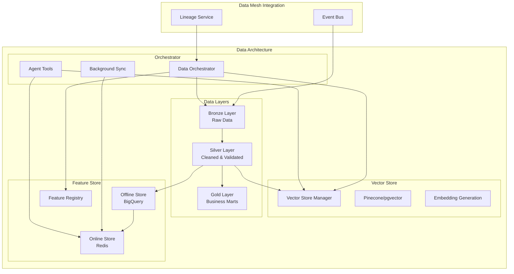

# Data Architecture

The **Data Architecture** provides vector stores, Bronze/Silver/Gold data layers, and feature stores that power the AI-native enterprise with fast, trustworthy, and lightning-fast data delivery for agent reasoning, ML models, and business intelligence.

## Architecture Overview

The Data Architecture consists of three core components that work together to provide comprehensive data management:

1. **Vector Store Integration** - Specialized storage for embeddings with fast K-NN similarity search
2. **Bronze/Silver/Gold Data Layers** - Lakehouse pattern for data quality progression
3. **Feature Store** - Online/offline feature serving for ML consistency



## Key Features

### 🔍 **Vector Store Integration**
- **Multiple Backends**: Support for Pinecone, pgvector, Milvus, and in-memory stores
- **Lineage Tracking**: Every embedding linked to source data with lineage IDs
- **RAG Optimization**: Fast similarity search optimized for retrieval-augmented generation
- **Agent Tools**: Ready-to-use tools for agent vector search integration

### 📊 **Bronze/Silver/Gold Data Layers**
- **Bronze Layer**: Raw data exactly as ingested with full replay capability
- **Silver Layer**: Cleaned, conformed data with PII masking and validation
- **Gold Layer**: Business-ready curated marts optimized for analytics
- **Lineage Tracking**: Complete data flow tracking across all transformations

### 🎯 **Feature Store**
- **Online Store**: Redis-based low-latency serving for real-time inference (<100ms)
- **Offline Store**: BigQuery/warehouse storage for batch processing and training
- **Consistency Guarantee**: Same feature values across training, batch, and online inference
- **Feature Registry**: Metadata management with ownership, TTL, and governance

## Data Flow Example

Here's how data moves through the architecture (from the specification):

```
1. Event lands → NetSuite CDC emits invoice_paid into Kafka
2. Bronze write → Raw JSON copied to Bronze bucket with lineage-ID
3. Silver transform → dbt job cleans types, masks PII → fin.invoice_silver
4. Gold mart → Daily aggregation produces finance.daily_cash_gold
5. Vector sync → Support agent embeds invoice memo text, upserts to Pinecone
6. Feature store ingest → finance.daily_cash_gold flows to Feature Store
7. Agents act → Customer Success uses features + vectors for decision making
```

## Usage

### Basic Setup

```python
from data_architecture import DataArchitectureOrchestrator
from data_mesh.event_bus import EventBusFactory
from data_mesh.lineage_service import LineageService

# Initialize infrastructure
event_bus = EventBusFactory.create("kafka")
lineage_service = LineageService()

# Configure data architecture
orchestrator = DataArchitectureOrchestrator(
    vector_store_config={
        "type": "pinecone",
        "api_key": "your_pinecone_key",
        "environment": "us-west1-gcp",
        "index_name": "ai-enterprise-vectors",
        "dimension": 1536
    },
    data_layer_config={
        "backend": "gcs",
        "base_path": "gs://company-data-lake",
        "project_id": "ai-enterprise-prod"
    },
    feature_store_config={
        "online_store": "redis",
        "offline_store": "bigquery"
    },
    event_bus=event_bus,
    lineage_service=lineage_service
)

await orchestrator.initialize()
```

### Full Data Pipeline

```python
# Execute complete data flow: Bronze → Silver → Gold + Vectors + Features
pipeline_result = await orchestrator.ingest_data_flow(
    raw_data=netsuite_invoice_data,
    source_system="netsuite",
    data_type="invoices",
    bronze_table="invoices_bronze",
    create_embeddings=True,
    create_features=True
)

print(f"Pipeline completed: {pipeline_result['success']}")
print(f"Bronze records: {pipeline_result['bronze_records']}")
print(f"Vector embeddings: {pipeline_result['vector_embeddings']['success']}")
print(f"Features materialized: {pipeline_result['features']['success']}")
```

### Vector Search for RAG

```python
# Store documents with embeddings
documents = [
    {
        "id": "pricing_policy_v1",
        "text": "Professional services pricing starts at $1000/month...",
        "title": "Pricing Policy",
        "source": "company_policies",
        "metadata": {"category": "pricing", "version": "1.0"}
    }
]

stored_ids = await orchestrator.vector_store_manager.store_embeddings(
    documents=documents,
    namespace="company_knowledge",
    lineage_id="policy_ingestion_001"
)

# Search for relevant documents
results = await orchestrator.vector_store_manager.similarity_search(
    query_text="How should I price a new customer contract?",
    namespace="company_knowledge",
    top_k=5
)

for result in results:
    print(f"Document: {result.metadata['title']}")
    print(f"Relevance: {result.score:.3f}")
    print(f"Source: {result.metadata['source']}")
```

### Feature Store Operations

```python
# Materialize features from source data
customer_data = [
    {
        "customer_id": "CUST-001",
        "total_orders": 15,
        "total_spent": 25000,
        "last_order_days": 3
    }
]

success = await orchestrator.feature_store_manager.materialize_features(
    feature_group_name="customer_features",
    source_data=customer_data,
    storage_mode=StorageMode.BOTH  # Online + Offline
)

# Get features for real-time inference (online store)
features = await orchestrator.feature_store_manager.get_online_features(
    feature_group_name="customer_features",
    entity_ids=["CUST-001", "CUST-002"],
    feature_names=["total_orders", "total_spent", "churn_risk_score"]
)

print(f"Customer CUST-001 features: {features['CUST-001']}")

# Create training dataset (offline store)
training_data = await orchestrator.feature_store_manager.create_training_dataset(
    feature_groups=["customer_features", "product_features"],
    start_time=datetime.now() - timedelta(days=30),
    end_time=datetime.now()
)
```

### Combined Search with Features

```python
# Unified search that combines vector similarity with feature enrichment
search_results = await orchestrator.search_and_retrieve(
    query="high-value customer churn risk",
    include_features=True,
    namespace="customer_data",
    top_k=10
)

for result in search_results["results"]:
    print(f"Customer: {result['id']}")
    print(f"Similarity: {result['score']:.3f}")
    print(f"Churn Features: {result.get('features', {})}")
```

### Agent Tool Integration

```python
# Create tools for agent use
agent_tools = await orchestrator.create_agent_tools()

# Available tools include:
# - vector_search: Semantic similarity search
# - get_customer_features: Customer feature retrieval  
# - get_product_features: Product feature retrieval
# - search_and_retrieve: Combined vector + feature search

for tool in agent_tools:
    print(f"Tool: {tool['function']['name']}")
    print(f"Description: {tool['function']['description']}")
```

## Component Details

### 1. Vector Store Integration

**Supported Backends:**
- **Pinecone**: Managed vector database with serverless scaling
- **pgvector**: PostgreSQL extension for vector operations
- **Milvus**: Open-source vector database
- **In-Memory**: For development and testing

**Features:**
- Automatic embedding generation (mock OpenAI compatible)
- Namespace-based organization
- Metadata filtering and search
- Lineage tracking for compliance
- Agent tool generation

**Use Cases:**
- Document retrieval for RAG workflows
- Customer similarity analysis for personalization
- Product recommendation based on embeddings
- Knowledge base search for support agents

### 2. Bronze/Silver/Gold Data Layers

**Bronze Layer (Raw Data):**
- Exact copy of ingested data
- JSON format preservation
- Full replay capability
- Lineage ID attachment
- Immutable storage (WORM compatible)

**Silver Layer (Cleaned Data):**
- Data type cleaning and validation
- PII masking and anonymization
- Schema conformance
- Parquet/Iceberg format
- Transformation rule application

**Gold Layer (Business Marts):**
- Business-friendly aggregations
- Customer 360 views
- Daily cash flow summaries
- Optimized for BI tools
- Delta Lake format for ACID transactions

**Transformation Rules:**
```python
# Example transformations applied in Silver layer
email_masking = TransformationRule(
    name="email_masking",
    transformation_type="mask",
    target_field="email"
)

data_validation = TransformationRule(
    name="amount_validation", 
    transformation_type="validate",
    target_field="amount"
)
```

### 3. Feature Store

**Online Store (Redis):**
- Sub-100ms feature retrieval
- TTL support for real-time data
- Key-value storage optimized for serving
- Automatic feature refresh

**Offline Store (BigQuery/Warehouse):**
- Historical feature storage
- Training dataset generation
- Point-in-time correctness
- SQL-based feature computation

**Feature Groups:**
```python
# Pre-configured feature groups
customer_features = [
    "total_orders",         # INT - Total order count
    "total_spent",          # FLOAT - Lifetime value  
    "last_order_days_ago",  # INT - Recency
    "avg_order_value"       # FLOAT - Average order size
]

product_features = [
    "sales_last_30d",       # INT - Recent sales velocity
    "revenue_last_30d",     # FLOAT - Revenue performance
    "avg_rating",           # FLOAT - Customer satisfaction
    "inventory_level"       # INT - Stock availability (TTL: 1h)
]
```

## Integration Points

### Data Mesh Integration

```python
# Event-driven data ingestion
from data_mesh.event_bus import Topics, Event

# Listen for data ingestion events
async def handle_cdc_event(event):
    await orchestrator.ingest_data_flow(
        raw_data=event.payload["records"],
        source_system=event.metadata.source_system,
        data_type=event.payload["table_name"],
        bronze_table=f"{event.payload['table_name']}_bronze"
    )

await event_bus.subscribe(Topics.DATA_INGESTION, handle_cdc_event)
```

### Lineage Service Integration

```python
# Automatic lineage tracking
lineage_trace = await orchestrator.data_layer_manager.get_lineage_trace(
    lineage_id="invoice_processing_20250112"
)

print(f"Bronze tables: {lineage_trace['bronze_tables']}")
print(f"Silver tables: {lineage_trace['silver_tables']}")  
print(f"Gold tables: {lineage_trace['gold_tables']}")
```

### Business Pillar Integration

```python
# Customer Success Agent using data architecture
from business_pillars.customer_success import ChurnSentinelAgent

class ObservableChurnSentinel(ChurnSentinelAgent):
    async def assess_churn_risk(self, customer_id: str):
        # Get customer features
        features = await orchestrator.feature_store_manager.get_online_features(
            feature_group_name="customer_features",
            entity_ids=[customer_id]
        )
        
        # Search for similar customer situations
        search_results = await orchestrator.search_and_retrieve(
            query=f"customer churn high value {features[customer_id]['total_spent']}",
            include_features=True,
            top_k=5
        )
        
        # Make churn assessment with full context
        return self._evaluate_churn_risk(features, search_results)
```

## Running the Demo

### Complete Demonstration

```bash
cd contributing/samples/data_architecture
python data_architecture_example.py
```

This runs a comprehensive demo including:

1. **Full Data Flow**: NetSuite CDC → Bronze → Silver → Gold + Vectors + Features
2. **Vector Store Capabilities**: Document storage, similarity search, RAG workflows
3. **Feature Store Workflows**: Online/offline feature serving, training datasets
4. **Data Layer Lifecycle**: Bronze ingestion, Silver transformation, Gold marts
5. **Agent Tool Integration**: Tools for vector search and feature retrieval
6. **ML Training Dataset**: Combined features and embeddings for model training

### Individual Component Testing

```python
# Test vector store only
from data_architecture.vector_store import VectorStoreManager

manager = VectorStoreManager(store_type=VectorStoreType.IN_MEMORY)
await manager.store_embeddings(documents, namespace="test")
results = await manager.similarity_search("test query", top_k=5)

# Test data layers only  
from data_architecture.data_layers import DataLayerManager

layer_manager = DataLayerManager()
lineage_id = await layer_manager.ingest_raw_data(data, "source", "table")
await layer_manager.process_bronze_to_silver("bronze_table", "silver_table")

# Test feature store only
from data_architecture.feature_store import FeatureStoreManager

feature_manager = FeatureStoreManager()
await feature_manager.materialize_features("customer_features", source_data)
features = await feature_manager.get_online_features("customer_features", ["CUST-001"])
```

## Production Deployment

### Cloud Storage Configuration

```python
# Production configuration with cloud backends
orchestrator = DataArchitectureOrchestrator(
    vector_store_config={
        "type": "pinecone",
        "api_key": os.getenv("PINECONE_API_KEY"),
        "environment": "us-west1-gcp-free",
        "index_name": "production-vectors"
    },
    data_layer_config={
        "backend": "gcs",
        "base_path": "gs://company-data-lake",
        "project_id": "ai-enterprise-prod"
    },
    feature_store_config={
        "online_store_config": {
            "redis_host": "redis.production.internal",
            "redis_port": 6379,
            "redis_password": os.getenv("REDIS_PASSWORD")
        },
        "offline_store_config": {
            "project_id": "ai-enterprise-prod", 
            "dataset_id": "feature_store"
        }
    }
)
```

### Monitoring & Observability

```python
# Dashboard monitoring
dashboard = await orchestrator.get_data_architecture_dashboard()

print(f"Vector Store: {dashboard['vector_store']['total_vectors']} vectors")
print(f"Data Layers: {dashboard['data_layers']['bronze']['total_records']} Bronze records")
print(f"Feature Store: {dashboard['feature_store']['feature_groups']} feature groups")
print(f"Sync Tasks: {dashboard['sync_tasks']}")
```

### Background Sync Configuration

```python
# Production sync schedules
- Feature sync: Every hour (online ← offline)
- Vector enrichment: Every 6 hours (metadata ← features)  
- Data layer cleanup: Daily (old Bronze data archival)
- Feature freshness: Real-time (streaming updates)
```

## Security & Compliance

### Data Protection
- PII masking in Silver layer transformations
- Encryption at rest for all storage layers
- Access control via IAM and Redis AUTH
- Audit logging for all data access

### Lineage Tracking
- Complete data flow tracking across all components
- Lineage IDs propagated through vector embeddings
- Feature store lineage for ML model traceability
- Integration with Trust & Observability Mesh

### GDPR Compliance
- Right to be forgotten via lineage-based deletion
- Data retention policies by storage layer
- Anonymization transformations in Silver layer
- Consent tracking in feature metadata

## Performance Considerations

### Latency Budgets
- Vector similarity search: <50ms (90th percentile)
- Online feature retrieval: <100ms
- Bronze data ingestion: <1s per batch
- Silver transformation: <5min per table

### Scalability
- Vector stores: Horizontal sharding by namespace
- Feature stores: Redis clustering for online serving
- Data layers: Partitioned storage by date/entity
- Background sync: Parallelized by feature group

### Cost Optimization
- Vector store: Configurable embedding dimensions
- Data layers: Hot/cold storage tiering
- Feature stores: TTL-based online store cleanup
- Compute: Spot instances for batch transformations

## Why Data Architecture is Critical

### Velocity
- **Real-time AI**: Sub-100ms feature serving enables real-time personalization
- **Fast Iteration**: Bronze layer replay enables rapid model experimentation  
- **Unified Tools**: Single API for vectors, features, and business data

### Safety
- **Data Quality**: Silver layer validation prevents garbage-in-garbage-out
- **Lineage Tracking**: Complete audit trail for regulatory compliance
- **PII Protection**: Automatic masking prevents data leaks

### Scale
- **Lakehouse Pattern**: Scales from MB to PB with consistent interface
- **Vector Search**: Purpose-built for AI workload similarity requirements
- **Feature Consistency**: Eliminates training/serving skew at any scale

The Data Architecture transforms raw business data into AI-ready vectors, features, and marts—the foundation for every intelligent decision your agent swarms make.

## Related Documentation

- [Vector Store Implementation](vector_store.py)
- [Data Layer Management](data_layers.py)
- [Feature Store Architecture](feature_store.py)
- [Data Orchestrator](data_orchestrator.py)
- [Data Mesh Integration](../data_mesh/README.md)
- [Reference Architecture](../react_supabase/ARCHITECTURE.md)