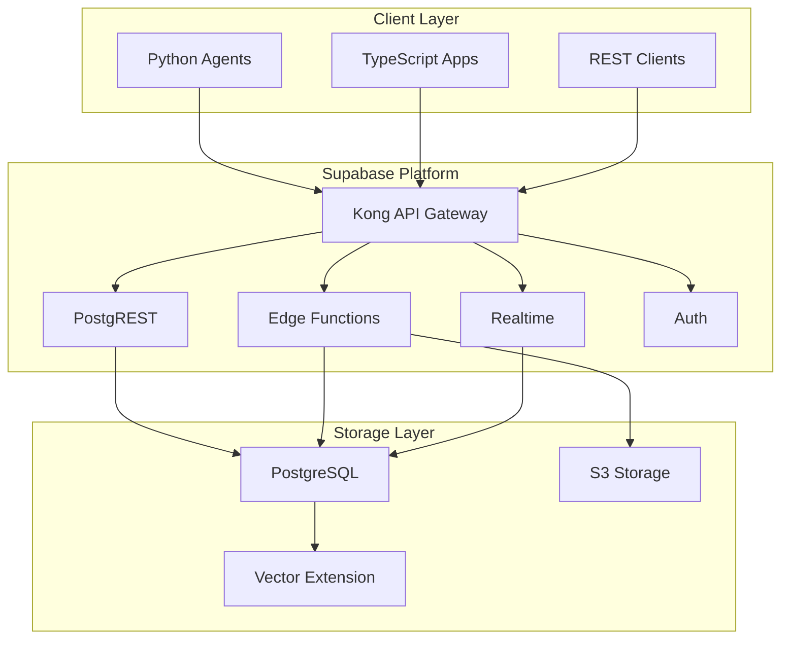

# MemCube Supabase Backend

A production-ready Supabase implementation of the MemCube memory system for AI agents. This provides a serverless, scalable backend with Edge Functions, real-time subscriptions, and built-in authentication.

## 🚀 Quick Start

### Prerequisites

1. [Supabase CLI](https://supabase.com/docs/guides/cli) installed
2. Supabase project created at [app.supabase.com](https://app.supabase.com)
3. Node.js 18+ (for Edge Functions)

### Setup Instructions

```bash
# 1. Clone and navigate to the project
cd memcube_supabase

# 2. Link to your Supabase project
supabase link --project-ref your-project-ref

# 3. Push database schema
supabase db push

# 4. Deploy Edge Functions
supabase functions deploy --no-verify-jwt

# 5. Set environment secrets
supabase secrets set OPENAI_API_KEY=your-key
supabase secrets set MARKETPLACE_WEBHOOK_URL=your-webhook
```

## 📁 Project Structure

```
memcube_supabase/
├── README.md                        # This file
├── supabase/
│   ├── config.toml                 # Supabase configuration
│   ├── migrations/                 # Database migrations
│   │   ├── 00001_initial_schema.sql
│   │   ├── 00002_storage_policies.sql
│   │   └── 00003_realtime_setup.sql
│   └── functions/                  # Edge Functions
│       ├── memories-crud/          # Memory CRUD operations
│       ├── memories-query/         # Advanced querying
│       ├── memories-schedule/      # Agent memory scheduling
│       ├── insights-process/       # Insight processing
│       ├── marketplace-publish/    # Pack publishing
│       ├── marketplace-import/     # Pack importing
│       └── lifecycle-manager/      # Automated maintenance
├── client/                         # Client SDKs
│   ├── typescript/                 # TypeScript SDK
│   └── python/                     # Python SDK
└── docs/                          # Documentation
    ├── API.md                     # API reference
    ├── DEPLOYMENT.md              # Deployment guide
    └── ARCHITECTURE.md            # System architecture
```

## 🏗️ Architecture Overview



## 🗄️ Database Schema

### Core Tables

```sql
-- Memories table (with RLS)
memories (
    id UUID PRIMARY KEY DEFAULT gen_random_uuid(),
    project_id TEXT NOT NULL,
    label TEXT NOT NULL,
    type memory_type NOT NULL,
    version INTEGER DEFAULT 1,
    governance JSONB NOT NULL,
    metadata JSONB,
    embedding vector(1536),
    created_by TEXT NOT NULL,
    created_at TIMESTAMPTZ DEFAULT now(),
    updated_at TIMESTAMPTZ DEFAULT now()
)

-- Memory payloads (separate for performance)
memory_payloads (
    memory_id UUID PRIMARY KEY REFERENCES memories(id),
    content TEXT,
    content_binary BYTEA,
    storage_mode storage_mode NOT NULL,
    size_bytes INTEGER NOT NULL,
    token_count INTEGER
)

-- Real-time task coordination
memory_task_links (
    memory_id UUID REFERENCES memories(id),
    task_id TEXT NOT NULL,
    role TEXT DEFAULT 'READ',
    created_at TIMESTAMPTZ DEFAULT now(),
    PRIMARY KEY (memory_id, task_id)
)
```

## 🔐 Security & Authentication

### Row Level Security (RLS)

All tables use RLS policies based on:
- Project membership
- Agent permissions
- Governance rules

### API Authentication

```typescript
// Client initialization
const supabase = createClient(url, anonKey, {
  auth: {
    persistSession: true
  }
})

// Agent authentication
const { data: { session } } = await supabase.auth.signInWithPassword({
  email: 'agent@project.com',
  password: agentSecret
})
```

## 🌐 Edge Functions

### 1. memories-crud
Handles basic CRUD with validation and governance.

```typescript
// Example: Create memory
const response = await supabase.functions.invoke('memories-crud', {
  body: {
    action: 'create',
    memory: {
      label: 'react-pattern',
      type: 'PLAINTEXT',
      content: 'Use hooks for state management'
    }
  }
})
```

### 2. memories-schedule
Intelligent memory selection for agents.

```typescript
// Example: Schedule memories
const response = await supabase.functions.invoke('memories-schedule', {
  body: {
    agent_id: 'bot-001',
    task_id: 'TASK-123',
    tags: ['react', 'hooks'],
    token_budget: 4000
  }
})
```

### 3. insights-process
Converts insights to memories with embeddings.

### 4. marketplace-publish
Publishes memory packs with watermarking.

### 5. lifecycle-manager
Runs maintenance tasks via cron.

## 🔄 Real-time Subscriptions

```typescript
// Subscribe to memory updates
const subscription = supabase
  .channel('memories')
  .on('postgres_changes', {
    event: '*',
    schema: 'public',
    table: 'memories',
    filter: `project_id=eq.${projectId}`
  }, (payload) => {
    console.log('Memory change:', payload)
  })
  .subscribe()
```

## 📊 Vector Search

Using pgvector for semantic search:

```sql
-- Find similar memories
SELECT * FROM memories
WHERE embedding <-> query_embedding < 0.3
ORDER BY embedding <-> query_embedding
LIMIT 10;
```

## 🚀 Deployment

### Production Checklist

- [ ] Enable RLS on all tables
- [ ] Set up backup policies
- [ ] Configure rate limiting
- [ ] Enable monitoring
- [ ] Set up CI/CD pipeline
- [ ] Configure custom domain

### Environment Variables

```env
# Supabase
SUPABASE_URL=https://xxx.supabase.co
SUPABASE_ANON_KEY=your-anon-key
SUPABASE_SERVICE_KEY=your-service-key

# External Services
OPENAI_API_KEY=sk-xxx
MARKETPLACE_WEBHOOK_URL=https://api.marketplace.com/webhook

# Storage
S3_BUCKET=memcube-payloads
S3_ACCESS_KEY=xxx
S3_SECRET_KEY=xxx
```

## 📈 Monitoring

Built-in Supabase monitoring plus:
- Custom metrics via Edge Function logs
- Realtime dashboard for memory usage
- Alerts for quota limits

## 🔗 Client SDKs

### Python SDK

```python
from memcube_supabase import MemCubeClient

client = MemCubeClient(
    url="https://xxx.supabase.co",
    key="your-anon-key"
)

# Store memory
memory = await client.memories.create({
    "label": "python-pattern",
    "content": "Always use type hints",
    "type": "PLAINTEXT"
})

# Query memories
memories = await client.memories.query({
    "tags": ["python", "typing"],
    "limit": 10
})
```

### TypeScript SDK

```typescript
import { createMemCubeClient } from '@memcube/supabase'

const client = createMemCubeClient(
  process.env.SUPABASE_URL,
  process.env.SUPABASE_ANON_KEY
)

// Store memory
const memory = await client.memories.create({
  label: 'typescript-pattern',
  content: 'Prefer interfaces over types',
  type: 'PLAINTEXT'
})
```

## 🛠️ Development

### Local Development

```bash
# Start Supabase locally
supabase start

# Watch Edge Functions
supabase functions serve

# Run migrations
supabase db reset

# Test Edge Functions
curl -i --location --request POST \
  'http://localhost:54321/functions/v1/memories-crud' \
  --header 'Authorization: Bearer YOUR_ANON_KEY' \
  --header 'Content-Type: application/json' \
  --data '{"action":"create","memory":{...}}'
```

## 📝 Migration from FastAPI

To migrate from the FastAPI implementation:

1. Run migration scripts in `/migrations`
2. Update client code to use Supabase SDK
3. Configure Edge Functions environment
4. Test with migration validator

## 🤝 Contributing

See [CONTRIBUTING.md](./CONTRIBUTING.md) for guidelines.

## 📄 License

MIT License - see [LICENSE](./LICENSE)