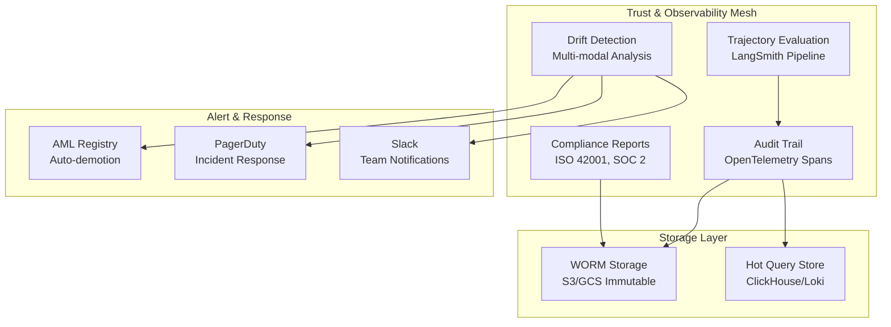

# Trust & Observability Mesh

The **Trust & Observability Mesh** is the "nervous system" of the AI-native enterprise that provides end-to-end visibility, drift detection, and compliance reporting. This layer enables humans, regulators, and other agents to see exactly what every agent thought, did, and why—and act the moment behavior strays from policy.

## Architecture Overview

The Trust & Observability Mesh consists of four core components:

1. **Audit Trail Generation & Storage** - OpenTelemetry-based span collection with immutable storage
2. **Trajectory Evaluation Pipelines** - Step-wise grading of agent reasoning quality  
3. **Drift Detection & Alerting** - Multi-modal anomaly detection with automatic response
4. **Compliance Reporting** - Automated evidence generation for regulatory frameworks



## Key Features

### 🔍 **Glass-Box Observability**
- Every agent step wrapped in OpenTelemetry AI spans
- Spans include lineage-ID, AML level, policy decisions, treasury tx-hash
- Real-time streaming to hot query store + immutable WORM storage

### 🎯 **Trajectory Evaluation**
- **Batch Mode**: Nightly replay of 24h spans through LangSmith/ADK with gold answers
- **Streaming Mode**: Critical pillars run inline evaluations every N requests (≤50ms latency)
- Automated scoring for reasoning quality, safety, compliance, cost-effectiveness

### 🚨 **Multi-Modal Drift Detection**
- **Data Drift**: Kolmogorov-Smirnov tests on feature distributions
- **Model Drift**: Performance degradation vs. control baselines  
- **Behavior Drift**: NLP similarity on tool-call sequences (detects prompt injection)
- Automatic AML demotion and emergency response

### 📋 **Compliance Automation**
- **ISO 42001**: AI Management System evidence packs
- **SOC 2**: Security and availability compliance reports
- **Sector-Specific**: HIPAA, PCI-DSS, GDPR modules
- Digitally signed reports with tamper-proof hash verification

## Live Incident Response

Here's how the system responds to anomalies end-to-end:

```
1. Anomaly appears → Pricing-Bot submits 60% markdown on high-demand SKU
2. Policy check → Engine sees margin floor 25%; rejects call, emits span with decision=deny  
3. Audit stream → Span hits OTel Collector → hot store; WORM copy saved
4. Trajectory eval → Streaming evaluator flags repeated violations, scores -0.8
5. Drift alert → Behavior drift watcher notes 5× spike in decision=deny over 1h
6. AML change → Control-Plane writes AML 3→1 for Growth pillar; requires approvals
7. Notification → Security-Sentinel opens PagerDuty; Slack includes trace-ID link
8. Compliance log → Incident auto-logged; appears in next weekly reports
```

## Usage

### Basic Setup

```python
from trust_observability import ObservabilityIntegration
from control_plane.aml_registry_enhanced import EnhancedAMLRegistry
from control_plane.policy_engine import LocalPolicyEngine

# Initialize components
aml_registry = EnhancedAMLRegistry()
policy_engine = LocalPolicyEngine(aml_registry=aml_registry)

# Create observability integration
observability = ObservabilityIntegration(
    aml_registry=aml_registry,
    policy_engine=policy_engine,
    enable_cloud_storage=True,
    storage_config={
        "worm_bucket": "ai-audit-worm",
        "hot_store_endpoint": "https://clickhouse.company.com:8443",
        "project_id": "my-ai-project"
    }
)

# Initialize
await observability.initialize()
```

### Tracking Agent Operations

```python
# Track agent execution with full observability
async with observability.track_agent_execution(
    agent_id="pricing_bot_001",
    pillar="Growth Engine", 
    operation="calculate_optimal_price",
    aml_level=3,
    trace_id="trace_12345"
) as span:
    
    # Track tool call
    await observability.track_tool_call(
        agent_id="pricing_bot_001",
        tool_name="calculate_price",
        tool_inputs={"product": "widget_pro", "demand": "high"},
        tool_outputs={"price": 299.99, "margin": 0.65},
        cost=0.05,
        trace_id="trace_12345",
        parent_span_id=span.span_data.span_id
    )
    
    # Track policy decision
    await observability.track_policy_decision(
        agent_id="pricing_bot_001",
        policy_decision="allow",
        policy_reasons=["within margin floor", "reasonable price adjustment"],
        trace_id="trace_12345"
    )
```

### Trajectory Evaluation

```python
# Run batch evaluation (nightly job)
batch_results = await observability.run_trajectory_evaluation("batch")
print(f"Evaluated {batch_results['spans_evaluated']} spans")
print(f"Average quality score: {batch_results['overall_statistics']['average_score']:.3f}")

# Get agent-specific evaluation summary
agent_summary = await observability.trajectory_evaluator.get_evaluation_summary(
    agent_id="pricing_bot_001",
    hours=24
)
print(f"Agent pass rate: {agent_summary['pass_rate']:.1%}")
```

### Drift Detection

```python
# Run drift analysis
drift_results = await observability.run_drift_analysis(hours_back=24)

# Check for alerts
total_alerts = drift_results['total_alerts']
if total_alerts > 0:
    print(f"🚨 {total_alerts} drift alerts detected")
    
    # Alerts automatically trigger:
    # - AML level adjustments 
    # - PagerDuty incidents
    # - Slack notifications
```

### Compliance Reporting

```python
# Generate ISO 42001 compliance report
iso_report = await observability.generate_compliance_report(
    report_type=ReportType.ISO_42001,
    days_back=30
)

print(f"Report ID: {iso_report['evidence_id']}")
print(f"Compliance metrics: {len(iso_report['metrics'])}")
print(f"Digital signature: {iso_report['signature'][:20]}...")

# Generate SOC 2 report
soc2_report = await observability.generate_compliance_report(
    report_type=ReportType.SOC_2,
    days_back=30
)

# Schedule automated weekly reports
weekly_reports = await observability.compliance_orchestrator.generate_weekly_reports()
```

### Observability Dashboard

```python
# Get comprehensive dashboard
dashboard = await observability.get_observability_dashboard()

print(f"System Status: {dashboard['observability_status']['system_status']}")
print(f"Total Spans (24h): {dashboard['audit_trail']['total_spans']:,}")
print(f"Success Rate: {dashboard['audit_trail']['success_rate']}%")
print(f"Policy Compliance: {dashboard['compliance']['overall_metrics']['policy_compliance_rate']}%")
```

## Component Details

### 1. Audit Trail Generation

**Features:**
- OpenTelemetry semantic conventions for AI operations
- Automatic lineage tracking with unique IDs
- Policy decision and AML level attribution
- Treasury transaction hash linkage
- Immutable WORM storage + hot query store

**Span Types:**
- `agent.execution` - Agent reasoning and decision making
- `agent.tool_call` - Tool invocation with inputs/outputs
- `policy.check` - Policy evaluation decisions
- `treasury.transaction` - Financial transaction tracking
- `workflow.step` - Business workflow steps
- `model.inference` - LLM inference calls

### 2. Trajectory Evaluation

**Evaluation Metrics:**
- **Reasoning Quality**: Chain-of-thought coherence and logic
- **Factual Accuracy**: Correctness of information and claims
- **Policy Compliance**: Adherence to business rules
- **Safety Score**: Risk assessment and harmful content detection
- **Cost Effectiveness**: Performance vs. computational cost
- **Efficiency Score**: Task completion speed and resource usage

**Modes:**
- **Batch Mode**: Comprehensive nightly evaluation with gold standards
- **Streaming Mode**: Real-time evaluation for critical operations (<50ms)
- **Ad-hoc Mode**: On-demand evaluation for specific traces

### 3. Drift Detection

**Detection Types:**

| Drift Type | Method | Threshold | Response |
|------------|--------|-----------|----------|
| **Data Drift** | Kolmogorov-Smirnov test | D > 0.1 | Monitor data sources |
| **Model Drift** | Performance degradation | >10% error increase | Model retraining |
| **Behavior Drift** | Tool sequence similarity | <70% similarity | Prompt injection check |
| **Policy Drift** | Violation rate spike | >5× normal rate | AML demotion |

**Alert Severity:**
- **LOW**: Minor deviations, continue monitoring
- **MEDIUM**: Notable changes, investigate within 24h
- **HIGH**: Significant drift, investigate within 4h 
- **CRITICAL**: Severe anomaly, immediate response + AML demotion

### 4. Compliance Reporting

**Report Types:**

| Standard | Frequency | Key Metrics | Evidence |
|----------|-----------|-------------|----------|
| **ISO 42001** | Weekly | AI system availability, policy compliance, risk coverage | Span summaries, AML changes, policy decisions |
| **SOC 2** | Monthly | Access controls, uptime, data integrity, encryption | Access logs, security events, encryption status |
| **HIPAA** | Quarterly | PHI access, audit trails, breach detection | Data access patterns, encryption verification |
| **PCI-DSS** | Monthly | Cardholder data protection, access monitoring | Payment processing logs, security controls |

**Evidence Pack Contents:**
- Anonymized span summaries for privacy
- Policy decision audit trail
- AML level change history
- Drift alert summaries
- Access and security logs
- Digital signature for tamper detection

## Integration Points

### Control Plane Integration

```python
# Automatic AML adjustments on drift
async def handle_drift_alert(alert: DriftAlert):
    if alert.severity == AlertSeverity.CRITICAL:
        # Emergency pause agent
        await aml_registry.emergency_pause(
            agent_group=f"{alert.agent_id}_group",
            changed_by="drift_detector",
            reason=f"Critical drift: {alert.description}"
        )
        
        # Activate kill switch for severe cases
        await aml_registry.activate_kill_switch(
            agent_group=f"{alert.agent_id}_group",
            changed_by="security_sentinel",
            reason="Automated response to critical behavior drift"
        )
```

### Data Mesh Integration

```python
# Event bus integration for cross-pillar observability
from data_mesh.event_bus import EventType, Event

# Publish drift alerts as events
alert_event = Event(
    event_type=EventType.ALERT,
    metadata=EventMetadata(
        source_pillar="Trust & Observability",
        priority=EventPriority.URGENT,
        trace_id=alert.alert_id
    ),
    payload=alert.to_dict()
)

await event_bus.publish(Topics.ALERTS, alert_event)
```

### Business Pillar Integration

```python
# Wrap business pillar agents with observability
from business_pillars.base import BusinessPillarAgent

class ObservablePillarAgent(BusinessPillarAgent):
    async def execute_task(self, task: str, context: Dict[str, Any], workflow_id: Optional[str] = None):
        # Create observability span
        async with observability.track_agent_execution(
            agent_id=self.agent_id,
            pillar=self.pillar.value,
            operation=task,
            aml_level=self.get_aml_level()
        ) as span:
            
            # Execute original task
            result = await super().execute_task(task, context, workflow_id)
            
            # Add result metadata to span
            span.add_attribute("task_result", result.get("success", False))
            
            return result
```

## Running the Demo

### Complete Demonstration

```bash
cd contributing/samples/trust_observability
python observability_example.py
```

This runs a comprehensive demo including:

1. **Live Incident Scenario**: Step-by-step demonstration of anomaly detection → policy check → drift alert → AML adjustment → compliance logging
2. **Audit Trail Generation**: Multi-agent span creation with full metadata
3. **Trajectory Evaluation**: Batch and streaming evaluation pipelines  
4. **Drift Detection**: Multi-modal drift analysis with alerting
5. **Compliance Reporting**: Automated ISO 42001 and SOC 2 report generation
6. **Observability Dashboard**: Real-time system status and metrics

### Individual Component Testing

```python
# Test audit trail only
from trust_observability.audit_trail import AuditTrailManager, SpanType

audit_manager = AuditTrailManager()
with audit_manager.create_span("test_operation", SpanType.AGENT_EXECUTION) as span:
    span.add_attribute("test", True)

# Test drift detection only  
from trust_observability.drift_detection import DriftMonitor

drift_monitor = DriftMonitor(audit_manager)
await drift_monitor.start_monitoring()

# Test compliance reporting only
from trust_observability.compliance_reporting import ComplianceOrchestrator

compliance = ComplianceOrchestrator(audit_manager)
report = await compliance.generate_report(ReportType.ISO_42001, start_date, end_date)
```

## Production Deployment

### Storage Configuration

```python
# Production storage with cloud backends
storage_config = {
    "worm_bucket": "gs://company-ai-audit-worm",
    "hot_store_endpoint": "https://clickhouse.internal.company.com:8443",
    "project_id": "production-ai-project",
    "retention_days": 2555,  # 7 years for compliance
    "encryption": "CSEK"     # Customer-supplied encryption keys
}

observability = ObservabilityIntegration(
    enable_cloud_storage=True,
    storage_config=storage_config
)
```

### Monitoring & Alerting

```python
# Production alerting configuration
drift_monitor = DriftMonitor(
    audit_manager,
    monitoring_window_hours=1,    # Check every hour
    baseline_window_days=14       # 2-week baseline
)

# Add production alert handlers
drift_monitor.add_alert_handler(pagerduty_handler)
drift_monitor.add_alert_handler(slack_handler)
drift_monitor.add_alert_handler(aml_adjustment_handler)
```

### Compliance Automation

```python
# Scheduled compliance reporting
import schedule

# Weekly ISO 42001 reports
schedule.every().monday.at("06:00").do(
    compliance_orchestrator.generate_weekly_reports
)

# Monthly SOC 2 reports  
schedule.every().month.do(
    compliance_orchestrator.generate_monthly_reports
)

# Quarterly audit prep
schedule.every(3).months.do(
    compliance_orchestrator.generate_audit_package
)
```

## Security & Privacy

### Data Protection
- All spans anonymized before storage
- PII detection and redaction
- Configurable retention periods
- GDPR right-to-be-forgotten support

### Access Controls
- Role-based access to audit data
- Audit trail access logging
- Compliance officer dashboards
- Read-only analyst access

### Tamper Protection
- Digital signatures on evidence packs
- Immutable WORM storage
- Hash chain verification
- Cryptographic audit trails

## Performance Considerations

### Latency Budgets
- Streaming evaluation: <50ms
- Policy decision tracking: <10ms
- Span creation overhead: <1ms
- Alert processing: <100ms

### Scalability
- Horizontal OTel collector scaling
- Partitioned hot storage
- Async audit trail processing
- Sampling for high-volume operations

### Cost Optimization
- Configurable sampling rates
- Hot/cold storage tiering
- Automated data lifecycle
- Compression and deduplication

## Why Advanced Observability is Critical

### Safety
- **Self-Healing**: Architecture automatically responds to anomalies before human intervention
- **Early Warning**: Detect and prevent runaway behaviors within seconds
- **Emergency Response**: Kill switches and AML demotion protect against severe incidents

### Velocity  
- **Performance Measurement**: Every outcome measured and scored for safe autonomy increases
- **Automated Quality Gates**: Objective criteria for promoting agent autonomy levels
- **Continuous Improvement**: Data-driven optimization of agent performance

### Trust
- **Regulatory Compliance**: Push-button readiness for audits and regulatory reviews  
- **Immutable Evidence**: Tamper-proof audit trails for legal and compliance requirements
- **Glass-Box AI**: Complete transparency into agent decision-making processes

The Advanced Observability system transforms black-box LLM swarms into glass-box, policy-aware, audit-ready machine—the prerequisite for running any real business on near-autonomous agents.

## Related Documentation

- [Control Plane Implementation](../control_plane/README.md)
- [Data/Integration Mesh](../data_mesh/README.md)  
- [Business Pillar Agents](../business_pillars/README.md)
- [Reference Architecture](../react_supabase/ARCHITECTURE.md)